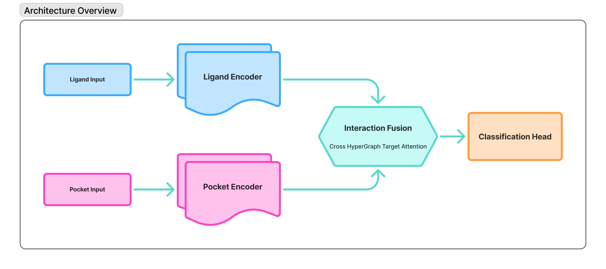

<div align="center">

# PPAR-γ Protein-Ligand Interaction Prediction with Graph Neural Networks


### Machine Learning with Graphs

A Graph Neural Network approach for predicting PPAR-gamma protein-ligand interactions using graph representations and protein language models

---

<div align="center">
  
  
  
  
  
  
</div>

</div>

---

## Overview

This project implements a **Fusion HyperGraph Neural Network** framework for predicting state-specific protein-ligand interactions, specifically targeting the **PPAR-gamma** receptor. The system leverages:

- **Hybrid Molecular Hypergraph representations** for ligands
- **Protein structure graphs** for binding pockets
- **Cross fusion geometric conditioning model** for integrating ligand and protein features
- **PyTorch Geometric** for efficient graph learning
- **Few-shot and zero-shot learning** capabilities

The goal is to predict whether a ligand will act as an **agonist** or **antagonist** for the PPAR-gamma receptor, which has implications for drug discovery in metabolic diseases.

---

## Architecture

### Pipeline Overview



## Getting Started

### Prerequisites

- Python 3.13+
- CUDA 11.8+ (for GPU support)
- Conda or UV package manager

### Environment Setup

```bash
# Clone the repository
git clone https://github.com/Aaryesh-AD/mlg-project-repo-t6.git
cd mlg-project-repo-t6

# Install dependencies and set up the environment
uv pip install -e .
source env-activate.sh
```

## Acknowledgments

This project was completed as part of **CSE-8803: Machine Learning with Graphs** (Fall 2025) at the **Georgia Institute of Technology**.

We would like to express our sincere gratitude to:

- **Dr. Yunan Luo**, our course instructor, for his invaluable guidance, mentorship, and support throughout this project.
- The creators of **NRLiSt BDB** and **RCSB-PDB** for providing high-quality protein-ligand interaction datasets
- The open-source community behind **PyTorch Geometric**, **RDKit**, **Scikit-learn**, and **Biopython** for their excellent tools and documentation

This work builds upon the rich literature in graph-based drug discovery, DTA models and protein-ligand interaction prediction.

---

<div align="center">

### 🐝 Georgia Institute of Technology

**Machine Learning with Graphs | Fall 2025**

*School of Computational Science and Engineering*

---


</div>

---
